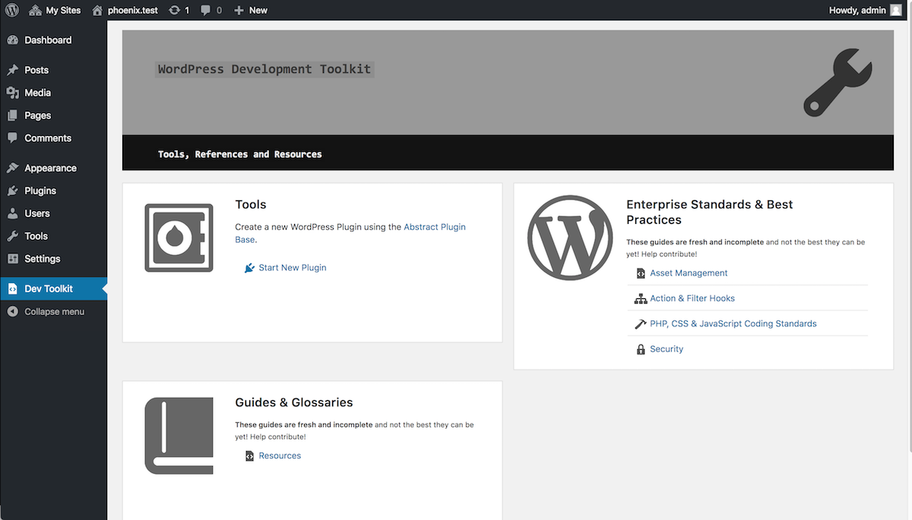
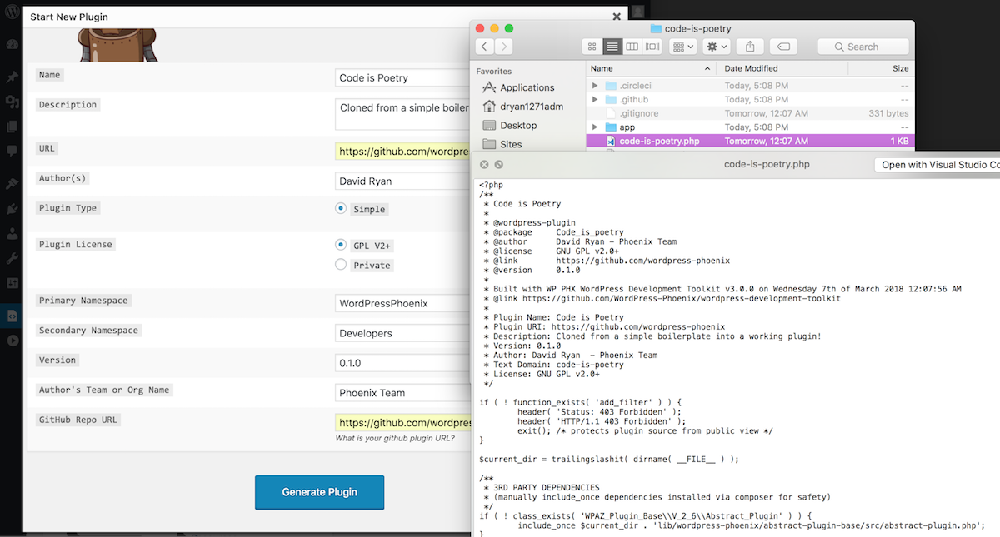

# WordPress Development Toolkit




1. Navigate to https://wp.docker/wp-admin/ (ask for login in main channel).

2. Download and clone this plugin (should NOT be run in production environments on high-traffic servers where 
performance matters...) into the onecms-docker plugins dir.

3. Navigate to Vanilla WP Network.

4. Go to Plugins.

5. Network activate plugin.

6. Go back to https://wp.docker/wp-admin/.

7. Open Dev Toolkit from Admin Menu link.

8. Click "Start New Plugin".

How to fill out the New Plugin form:


4. Click Generate New Plugin. This will deliver a new zip file. Check that your namespace has been correctly generated.

## UPDATING `/lib` files

Lib files come from composer, but you need to ensure you run the command without the composer autoloader:
```
composer update --no-dev --no-autoloader
```

## Offline Development Mode

The plugin uses the GitHub API to fetch the latest copy of the Abstract Plugin Base to include in the plugin. You can alternatively set:
```php
define( 'WP_DEV_KIT_AIRPLANE_MODE', true )
```
to pull the ABP powering this plugin for internet-less development.

